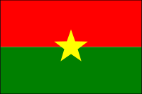

# Vexillogram

Generate SVG image of a flag using a DSL based on standard vexillographical terms

## Description

> vexillogram (noun): A picture or design specification of a flag

The _Vexillogram_ gem implements a DSL (domain-specific language) that will output an SVG image of a flag, using the terms from vexillography (the study of flags).

### Examples

The vexillographic description of the [flag of Burkina Faso](https://en.wikipedia.org/wiki/Flag_of_Burkina_Faso) is:

> Two horizontal bands of red and green with a yellow five-pointed star in the center. Proportion 2:3.

This can be translated in the _vexillogram_ DSL like this:

```ruby
Vexillogram.new('Burkina Faso', aspect_ratio: '2:3') do
  field { [
      horizontal_band(color: 'red', from: 0, to: 0.5),
      horizontal_band(color: 'green', from: 0.5, to: 1.0)
  ] }

  charge { star(color: 'yellow', size: 0.25, points: 5) }
end
```

..which will output the image as:



## Scope and Purpose

_Vexillogram_ and the DSL is uses are meant to be __descriptive__, not __definitive__. The focus is on approximation, not completeness.

This means a flag description is not expected to include exact details, and the rendered output should not be expected to completely match the official version of the flag. Things such as exact size and placement of elements, complex representations, or anything involving precise detail are not the focus of this project.

## Installation

Add this line to your application's Gemfile:

```ruby
gem 'vexillogram'
```

And then execute:

    $ bundle install

Or install it yourself as:

    $ gem install vexillogram

## Usage

See [examples](/examples).

JSON format and parser are also planned

## Development

After checking out the repo, run `bin/setup` to install dependencies. Then, run `rake spec` to run the tests. You can also run `bin/console` for an interactive prompt that will allow you to experiment.

To install this gem onto your local machine, run `bundle exec rake install`. To release a new version, update the version number in `version.rb`, and then run `bundle exec rake release`, which will create a git tag for the version, push git commits and the created tag, and push the `.gem` file to [rubygems.org](https://rubygems.org).

## To-Do

The to-do list is long and will probably always be, as long as humans keep using flags.
### Elements

* Border/bordure
* Canton
  - File present but not tested
* Impale/Impaled
  1. (v) In heraldry a term for the marshalling of (or having earlier marshalled) two sets of arms side-by-side on a shield or banner of arms to indicate marriage or alliance – empale (see also ‘banner of arms’, ‘coat of arms 2)’, ‘dimidiated’, ‘entire 1)’, ‘escutcheon of pretence 2), ‘marshalling’, ‘point-in-point’, ‘quarter the arms’ and ‘quartering 1)’)
  2. (v) On flags as above, but the images placed on a flag need not be arms as defined herein.
* Quadrisection
  - aka Quartering
* Greek Cross (Switzerland)
* Symmetric cross
* Fess
* Bend / Bend Sinister
* Chevron / Chevron Reversed / Chevron Arched or Enarched
* Pall
* Saltire
* Text Element
* "Placeholder" element
  - an enclosed primitive (rect, circle, poly) that contains text. The text names the Element that would be here if available
  - Example: Utah state flag, the Great Seal replaced placeholder of aproximate size and colour with text that reads "GREAT SEAL OF UTAH"
  - Clip the text to bounds of the placeholder

### Arrangements of Charges
* Per Fess
* Per Pale
* Per Pall
* Per Saltire
  * two separate objects or charges are placed across each other diagonally on a flag, shield or banner of arms - saltirewise, in_saltire

### Core

* A json format to represent the description of a flag, like the Ruby code but language-agnostic
  - A parser, to generate an SVG from a json description
  - A generator, to output a json description from the given Ruby code
* Colours: Augment the existing color lookup system to accept standard heraldic colour names
  - Metals: Argent (Silver/White), Or (Gold/Yellow), Copper, Buff (light brownish-yellow, typical of buff leather, treated as metal in USA)
  - Colours: Gules (red), Sable (black), Azure (blue), Vert (green), Purpure (purple)
  - Non-traditional Colours: Bleu celeste (Sky Blue Bleu de Ciel), Brunâtre (brown), Buff (light brownish-yellow, typical of buff leather, treated as color in Canada), Carnation (pale or white human skin), Cendrée (Cinder, Ash Grey), Ochre (both red and yellow), Orange (different from Tenné), Rose (pink)
  - Furs: Ermines (Erminois, Erminites, Pean), Vair (Potent)
  - Stains: Murrey (mulberry), Sanguine (blood red), Tenné (Orange/Light Brown/Tawny Orange)
* Patterns within an element to use with or instead of a colour (see https://en.wikipedia.org/wiki/Variation_of_the_field)
  * option to specify external file to use as pattern
* Shapes/Aspect Ratios
  - Nepal
  - Inclined-Fly
  - Pennon/Pennant, Swallow-tail, etc

## Contributing

Contributions of code **and** knowledge are welcome. There are many vexillographic conventions and terms that are still not universally agreed upon and civil discussion of the best way to handle these cases is always helpful.

Bug reports and pull requests are welcome on GitHub at https://github.com/[USERNAME]/vexillogram. This project is intended to be a safe, welcoming space for collaboration, and contributors are expected to adhere to the [code of conduct](https://github.com/[USERNAME]/vexillogram/blob/main/CODE_OF_CONDUCT.md).

## License

The gem is available as open source under the terms of the [MIT License](https://opensource.org/licenses/MIT).

## Code of Conduct

Everyone interacting in the Vexillogram project's codebases, issue trackers, chat rooms and mailing lists is expected to follow the [code of conduct](https://github.com/[USERNAME]/vexillogram/blob/main/CODE_OF_CONDUCT.md).
