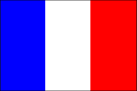

# Vexillogram Examples

### [Burkina Faso](burkina_faso.rb)

-----
### [Canada](canada.rb)

-----
### [Chicago](chicago.rb)

-----
### [Denmark](denmark.rb)

-----
### [France](france.rb)

-----
### [Japan](japan.rb)

-----
### [Sweden](sweden.rb)

